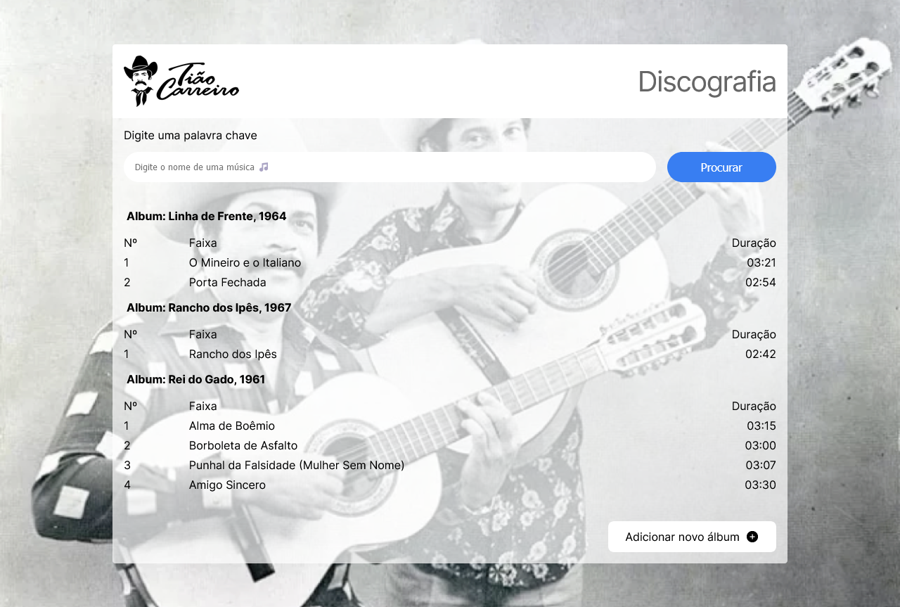

# Discografia Tião Carreiro & Pardinho


<p align="center">

</p>

> Projeto com a discografia da dupla Tião Carreiro & Pardinho

### Ajustes e melhorias

Projeto concluído!

- [x] Desenvolvimento de todo o projeto em SPA utilizando React
- [x] Consumo de REST API
- [x] Páginas responsivas
- [x] Criação e exclusão de músicas e álbuns

## 💻 Pré-requisitos

Antes de começar, verifique se você atendeu aos seguintes requisitos:

* Você instalou a versão mais recente de `Node.js` e `npm`.

## 🚀 Instalando Discografia Tião Carreiro & Pardinho

Para instalar o Discografia Tião Carreiro & Pardinho , siga estas etapas:

* Clone esse repositório com `git clone https://github.com/gguilhermelopes/supliu-test`
* Entre na pasta com `cd supliu-test`
* Instale as dependências com `npm install`
* É necessário um arquivo de váriaveis de ambiente (.env) como no exemplo abaixo

```
VITE_BASE_API_URL = URL da API

VITE_API_TOKEN = Token para utilização da API
```


## ☕ Usando Discografia Tião Carreiro & Pardinho

Para usar Discografia Tião Carreiro & Pardinho, siga estas etapas:

* Certifique-se de que todas as dependências foram instaladas, que o arquivo .env esteja configurado corretamente e que esteja na pasta do projeto. Utilize `npm run dev` e veja em qual porta do seu ambiente local ele foi executado.
